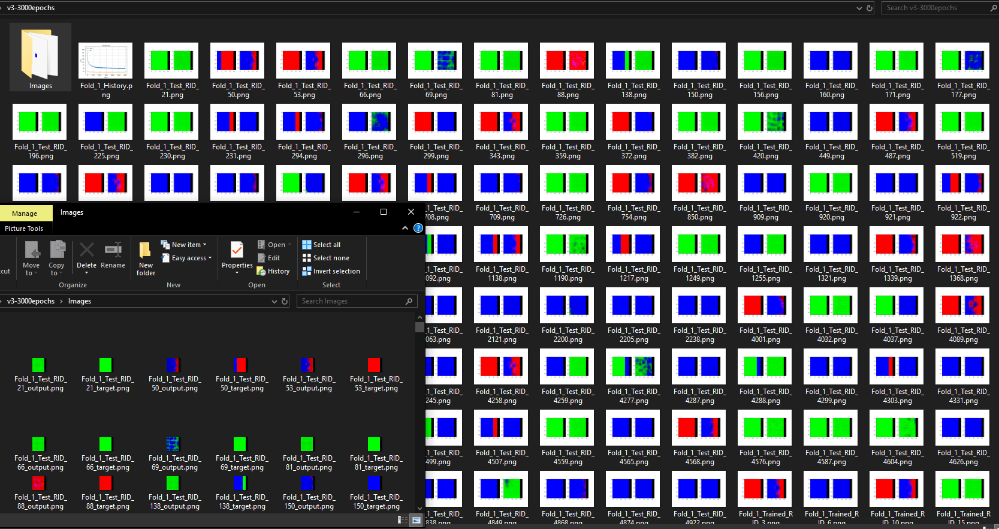

# ML4VisAD
Machine Learning for the Visualization of Alzheimer's Disease

Paper under review.

Tensorflow 2.4 and Python 3.7 are used for this research. 
Requirements are available at requirements.txt

Data_XY_BLD_v0 is the CSV dataset, a subset of QT-PAD challenge dataset and ADNI. 

Results_v5-4000epochs(paper).zip contains all the results of the ML algorithm for diagnosis and prognosis of AD on 10-fold cross validation.

Pr_Tensorization_v5_RID(paper).py is the code including data normalization, network model and train/testing with cross-validation.

The zip file contains some results.

